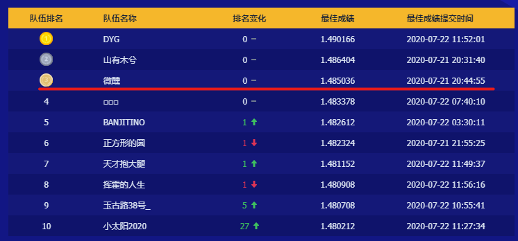

# [TAAC2020](https://algo.qq.com/index.html?htarget=Introduction)

腾讯广告算法大赛步入第四年，已经为来自海内外的企业和研究人员提供了富有研究价值和应用价值的议题，有效地推动了产学研的交流与融合。本届算法大赛的题目“广告受众基础属性预估”兼具实用性和趣味性，从广告行业的经典假设出发，逆向验证这一命题的科学性。参赛者需要探索来自真实业务的海量脱敏数据，综合运用机器学习领域的各种技术，实现更准确的预估。



## 1. 赛题说明
本届算法大赛的题目来源于一个重要且有趣的问题。人口统计学特征是各类推荐系统的重要输入特征，其中自然也包括了广告平台。大多数验证所采用的方式都是以人口统计学属性作为输入来产生推荐结果，然后离线或者在线地对比用与不用这些输入的情况下的推荐性能。本届大赛的题目尝试从另一个方向来验证这个假设，即以用户在广告系统中的交互行为作为输入来预测用户的人口统计学属性。

我们认为这一赛题的“逆向思考”本身具有其研究价值和趣味性，此外也有实用价值和挑战性。例如，对于缺乏用户信息的实践者来说，基于其自有系统的数据来推断用户属性，可以帮助其在更广的人群上实现智能定向或者受众保护。与此同时，参赛者需要综合运用机器学习领域的各种技术来实现更准确的预估。（所有数据均为脱敏处理后的数据。）

## 2. 目录结构
```
.
├── data (数据目录)
│   ├── download.py (下载比赛数据)
│   └── w2v (词向量目录)
├── src
│   ├── concat_feats.py (拼接特征)
│   ├── get_lgb_feas.py (生成LGB特征)
│   ├── get_seqs.py (从日志中提取行为序列)
│   ├── get_stat_feats.py (生成统计特征)
│   ├── lstm0.py (训练lstm模型0)
│   ├── lstm1.py (训练lstm模型1)
│   ├── lstm2.py (训练lstm模型2)
│   ├── lstm3.py (训练lstm模型3)
│   ├── preprocess.py (数据预处理)
│   ├── utils.py (工具类/方法)
│   └── w2v.py (训练word2vec词向量)
├── picture
├── run.sh (执行脚本)
└── README.md
```

## 3. 环境依赖

* numpy 1.18.5 
* pandas 1.0.5
* pytorch 1.4.0
* scikit-learn 0.23.1
* tqdm 4.48.0
* scipy 1.5.0

## 4.运行

```
bash run.sh
```
